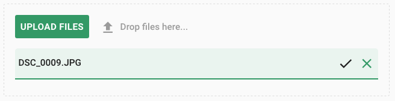
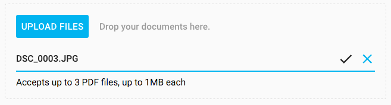

[[vaadin-upload.custom]]
= Customization

It is possible to customize the [elementname]#vaadin-upload# element in two ways: changing default styles, or providing custom content.

== Styling

To override default styles you should use Polymer mixins.

[source,html]
----

 <vaadin-upload></vaadin-upload>
----

[[figure.vaadin-upload.custom1]]
.A Custom CSS

=== Color properties
[elementname]#vaadin-upload# reuses certain color properties from paper styles:

[width="100%", options="header"]
|======================
|Property name | default color
| [propertyname]#primary-color# | #00B4F0
| [propertyname]#primary-text-color# | #000
| [propertyname]#light-primary-color# | #7CD8F7
| [propertyname]#error-color# | #f40303
| [propertyname]#disabled-text-color# | #b3b3b3 or gray
| [propertyname]#divider-color# |  #666 or #e0e0e0
|======================

=== Custom CSS properties

The following custom properties are available for styling the component.

==== Styles for the [elementname]#vaadin-upload# element

[width="100%", options="header"]
|======================
|Property name | Description
| [propertyname]#--vaadin-upload-buttons# | Styles for the buttons container
| [propertyname]#--vaadin-upload-button# | Styles for the upload button
| [propertyname]#--vaadin-upload-file-list# | Styles for the file list
| [propertyname]#--vaadin-upload-drop-label# | Styles for the drop label
| [propertyname]#--vaadin-upload-drop-label-dragover# | Styles for the drop label when overing the component with files
| [propertyname]#--vaadin-upload-drop-label-icon# | Styles for the drop icon
| [propertyname]#--vaadin-upload-drag-ripple# | Styles for the ripple animation in the drop area
|======================

==== Styles for the [elementname]#vaadin-upload-file# element

[width="100%", options="header"]
|======================
|Property name | Description
| [propertyname]#--vaadin-upload-file# | Styles for the entire host element
| [propertyname]#--vaadin-upload-file-row# | Styles for the file row
| [propertyname]#--vaadin-upload-file-meta# | Styles for the info container
| [propertyname]#--vaadin-upload-file-name# | Styles for the file name
| [propertyname]#--vaadin-upload-file-status# | Styles for the file status label
| [propertyname]#--vaadin-upload-file-error# | Styles for the file error label
| [propertyname]#--vaadin-upload-file-commands# | Styles for the buttons container
| [propertyname]#--vaadin-upload-file-progress# | Styles for the included paper-progress
| [propertyname]#--vaadin-upload-file-progress-error# | Styles for the progress bar when error is set
| [propertyname]#--vaadin-upload-file-progress-indeterminate# | Styles for the progress bar when indeterminate
| [propertyname]#--vaadin-upload-file-progress-uploading-indeterminate# | Styles for the progress bar when uploading and indeterminate
| [propertyname]#--vaadin-upload-file-progress-complete# | Styles for the progress bar when uploading the file is complete
|======================

== Modifying the content

[elementname]#vaadin-upload# provides content composition through the element's light DOM.

There are two modifiable parts: the content with the drop label before the file list and the part after it.
The first part must be marked with the class name `drop-label`, whereas the second one is composed with the remaining element content.
Right now, it is not possible to customize the file list using templates, but will be possible soon.

The following example shows how to modify them:

[source,html]
----
<vaadin-upload >
  

    Drop your documents here.
  

  <!-- File list is here -->
  

    Accepts up to 3 PDF files, up to 1MB each
  

  <!-- Buttons go here -->
</vaadin-upload>
----

[[figure.vaadin-upload.custom2]]
.Custom content

